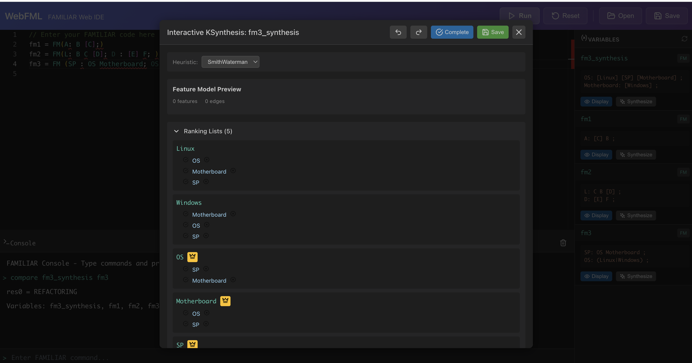

# WebFML - FAMILIAR Web IDE

FAMILIAR goes to the web...
The goal is to progressively migrate our (unrelated) tools to the web.
The long term vision is to have an integrated solution at the end, including:
 * reverse engineering,
 * testing,
 * advanced feature modeling
 * model-based product lines.

Promises:
 * Better integration of tools
 * Ease of development (especially user interfaces)
 * Usable environments
 * More visible impact
 * Deployment facilities



## Features

 * **Code Editor**: Monaco-based editor with syntax highlighting for FAMILIAR scripts
 * **Interactive Console**: Execute commands and see results in real-time
 * **Variables Panel**: View all defined variables with their values
 * **Feature Model Display**: Visualize feature models directly in the IDE
 * **Interactive KSynthesis**: Synthesize feature models interactively with multiple heuristics (SmithWaterman, Levenshtein, AlwaysZero, Random)
 * **File Management**: Open and save FAMILIAR scripts

## Technology Stack

### Backend
- **Spring Boot 3.2.1** with Java 21
- **FAMILIAR** language interpreter
- **KSynthesis** library for feature model synthesis
- RESTful API architecture

### Frontend
- **React 18** with TypeScript
- **Vite 5** for fast development and building
- **Monaco Editor** for code editing
- **Lucide React** for icons

## Prerequisites

- Java 21 or higher
- Node.js 18+ and npm (or pnpm)
- Maven 3.8+
- FAMILIAR and KSynthesis libraries installed locally

## Installation

### 1. Build FAMILIAR

```bash
git clone git@github.com:FAMILIAR-project/familiar-language.git
cd familiar-language
mvn clean install -DskipTests
```

### 2. Build KSynthesis

```bash
git clone https://github.com/gbecan/FOReverSE-KSynthesis.git
cd FOReverSE-KSynthesis
mvn clean install -DskipTests
```

### 3. Build and Run WebFML

```bash
git clone git@github.com:FAMILIAR-project/webfml.git
cd webfml

# Build and run backend
cd backend
mvn clean install
mvn spring-boot:run

# In another terminal, build and run frontend
cd frontend
npm install
npm run dev
```

The application will be available at:
- Frontend: http://localhost:5173
- Backend API: http://localhost:8080

## Docker Support

Build and run with Docker Compose:

```bash
docker-compose up --build
```

Or build images separately:

```bash
# Backend
cd backend
docker build -t webfml-backend .

# Frontend
cd frontend
docker build -t webfml-frontend .
```

## Project Structure

```
webfml/
├── backend/                    # Spring Boot backend
│   └── src/main/java/fr/inria/familiar/webfml/
│       ├── controller/         # REST controllers
│       │   ├── FamiliarController.java      # FAMILIAR interpreter endpoints
│       │   └── KSynthesisController.java    # KSynthesis session endpoints
│       ├── service/            # Business logic
│       │   ├── FamiliarInterpreterService.java  # Manages FML interpreters
│       │   └── KSynthesisService.java           # Manages synthesis sessions
│       └── dto/                # Data transfer objects
├── frontend/                   # React frontend
│   └── src/
│       ├── components/         # React components
│       │   ├── Editor.tsx           # Monaco code editor
│       │   ├── Console.tsx          # Interactive console
│       │   ├── Toolbar.tsx          # Action buttons
│       │   ├── VariablesPanel.tsx   # Variables list
│       │   └── KSynthesisPanel.tsx  # Interactive synthesis UI
│       └── api/
│           └── client.ts       # API client
└── docker-compose.yml          # Docker orchestration
```

## API Endpoints

### FAMILIAR Interpreter
- `GET /familiar/keywords` - Get FAMILIAR keywords for syntax highlighting
- `POST /familiar/interpret` - Execute FAMILIAR code
- `GET /familiar/variables` - List all defined variables
- `GET /familiar/variables/{id}` - Get variable value
- `POST /familiar/reset` - Reset the interpreter session

### KSynthesis
- `POST /familiar/ksynthesis/start` - Start synthesis session for a feature model
- `POST /familiar/ksynthesis/select-parent` - Select a parent for a feature
- `POST /familiar/ksynthesis/ignore-parent` - Ignore a parent candidate
- `POST /familiar/ksynthesis/set-root` - Set a feature as root
- `POST /familiar/ksynthesis/complete` - Auto-complete the synthesis
- `POST /familiar/ksynthesis/undo` - Undo last action
- `POST /familiar/ksynthesis/redo` - Redo last undone action
- `POST /familiar/ksynthesis/save` - Save synthesized feature model
- `GET /familiar/ksynthesis/heuristics` - List available heuristics

## Usage

1. Write FAMILIAR code in the editor (left panel)
2. Click "Run" to execute the script
3. View results in the console (bottom panel)
4. See defined variables in the Variables panel (right panel)
5. For feature model variables, click:
   - **Display** to view the feature model structure
   - **Synthesize** to open the interactive KSynthesis panel

### Example FAMILIAR Code

```
fm1 = FM(A: B [C];)
fm2 = FM(L: B C [D]; D : [E] F;)
fm3 = FM (SP : OS Motherboard; OS: (Linux|Windows);)
compare fm1 fm2
```

## History

This project was originally built with Play! Framework 2.2.0 (Scala) and has been modernized to use:
- Spring Boot 3.x (replacing Play! Framework)
- React 18 with TypeScript (replacing Scala templates)
- Monaco Editor (replacing ACE editor)
- Modern build tools (Maven + Vite)

## Contributing

Contributions are welcome! Please feel free to submit issues and pull requests.

## License

See the LICENSE file for details.
